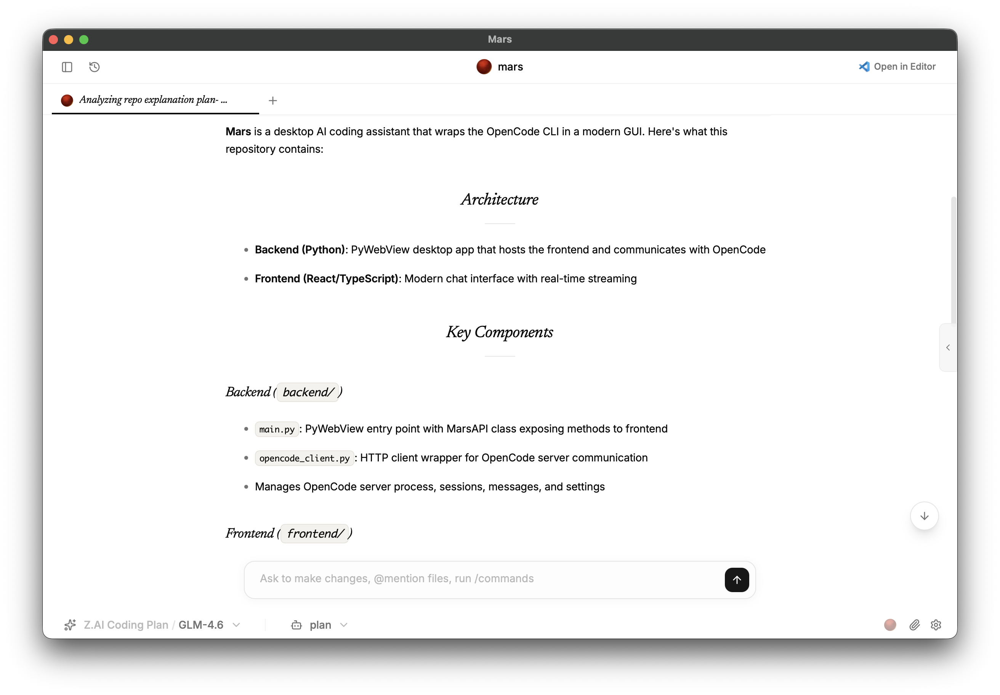

<div align="center">
  
  
  <h1>Mars</h1>
  
  <p>
    <strong>A modern desktop AI coding assistant powered by OpenCode</strong>
  </p>
  
  <p>
    Built with Python (PyWebView) backend and React frontend for a seamless native experience
  </p>
  
  [](https://opensource.org/licenses/MIT)
  [](https://www.python.org/)
  [](https://reactjs.org/)
  [](https://www.typescriptlang.org/)
</div>

## Overview

Mars is a sophisticated desktop application that provides an AI-powered coding assistant interface. It wraps the OpenCode CLI tool in a user-friendly GUI, allowing you to have conversational coding sessions with various AI models and providers. Experience the power of AI-assisted development in a native desktop environment.

## Architecture

The application consists of two main components:

### Backend (Python)
- **PyWebView**: Creates a native desktop window that hosts the web frontend
- **OpenCode Integration**: Manages the OpenCode server process and communicates via HTTP API
- **Event Streaming**: Handles real-time streaming of AI responses, tool calls, and reasoning
- **Settings Management**: Persists user preferences and model selections

### Frontend (React/TypeScript)
- **Modern UI**: Built with React 19, TypeScript, and Tailwind CSS
- **shadcn/ui Components**: Clean, accessible UI components
- **Real-time Chat**: Multi-session chat interface with streaming responses
- **Model Selection**: Dynamic provider and model selection with search
- **Tool Visualization**: Interactive display of AI tool calls and reasoning steps

## ✨ Features

- 🖥️ **Native Desktop Experience** - Built with PyWebView for cross-platform desktop integration
- 💬 **Multi-Session Chat** - Tabbed interface for managing multiple coding conversations
- 🤝 **Multi-Provider Support** - Works with OpenAI, Anthropic, and other AI providers
- 🔄 **Real-Time Streaming** - Watch AI responses, tool calls, and reasoning unfold in real-time
- 🛠️ **Interactive Tool Visualization** - Expandable displays for tool calls with status indicators
- 📁 **Built-in File Explorer** - Navigate and edit your project files without leaving the app
- 📊 **Detailed Metadata** - Track token usage, costs, and timing information
- ⚙️ **Persistent Settings** - Your preferences and model selections are saved automatically
- 🎨 **Modern UI** - Clean, accessible interface with dark/light theme support
- ⌨️ **Keyboard Shortcuts** - Productivity-focused shortcuts for power users

## 🚀 Quick Start

### Prerequisites

- **Python 3.10+** - For the backend PyWebView application
- **Node.js 18+** - For frontend development and building
- **OpenCode CLI** - Install with `pip install opencode`
- **AI Provider API Key** - Configure at least one provider in OpenCode

### One-Command Setup

```bash
# Clone and set up the project
git clone https://github.com/beratcmn/mars.git
cd mars

# Install backend dependencies
cd backend && uv sync && cd ..

# Install frontend dependencies  
cd frontend && npm install && cd ..

# Start the application
cd backend && python main.py
```

### Detailed Installation

#### Backend Setup

1. Navigate to the backend directory:
```bash
cd backend
```

2. Install Python dependencies using [uv](https://github.com/astral-sh/uv):
```bash
uv sync
```

#### Frontend Setup

1. Navigate to the frontend directory:
```bash
cd frontend
```

2. Install Node.js dependencies:
```bash
npm install
```

## 🛠️ Development

### Running the Application

#### Development Mode

1. **Start the frontend development server**:
```bash
cd frontend
npm run dev
```

2. **Run the backend application**:
```bash
cd backend
python main.py
```

The PyWebView window will open and automatically connect to the Vite dev server at `localhost:5173`.

#### Production Mode

1. **Build the frontend**:
```bash
cd frontend
npm run build
```

2. **Run the backend**:
```bash
cd backend
python main.py
```

The application will load the production build from `frontend/dist/`.

### 📦 Building Desktop Apps

#### macOS (PyInstaller)

From the repository root:

```bash
./scripts/build.sh
```

This script:
- ✅ Builds the frontend with Vite
- ✅ Copies the built `dist/` into `backend/dist/`
- ✅ Packages the app with PyInstaller using the custom icon
- ✅ Creates a standalone `.app` bundle

**Prerequisites:**
- macOS 10.15+ 
- Python 3.10+, Node.js 18+
- OpenCode CLI in PATH
- [uv](https://github.com/astral-sh/uv) for PyInstaller execution

**Output:** `backend/build/mars.app`

#### Cross-Platform

For Windows and Linux builds, you can use PyInstaller directly:

```bash
cd backend
uv run pyinstaller --onefile --windowed --icon=assets/logo.png main.py
```

## 📁 Project Structure

```
mars/
├── 🖼️ assets/
│   └── hero.png           # Hero image for README
├── 🐍 backend/
│   ├── main.py            # PyWebView entry point and MarsAPI
│   ├── opencode_client.py # OpenCode HTTP client wrapper
│   ├── pyproject.toml     # Python project configuration
│   ├── settings.json      # User settings storage
│   └── assets/
│       └── logo.png       # Application icon
├── ⚛️ frontend/
│   ├── src/
│   │   ├── components/    # React components
│   │   │   ├── ui/       # shadcn/ui components
│   │   │   ├── ChatArea.tsx
│   │   │   ├── ChatTabs.tsx
│   │   │   ├── Header.tsx
│   │   │   ├── InputBar.tsx
│   │   │   ├── ModelSelector.tsx
│   │   │   └── Footer.tsx
│   │   ├── lib/          # Utilities and API
│   │   │   ├── api.ts    # PyWebView API bridge
│   │   │   └── utils.ts  # Utility functions
│   │   ├── App.tsx       # Main application component
│   │   ├── main.tsx      # React entry point
│   │   └── index.css     # Tailwind CSS styles
│   ├── package.json      # Node.js dependencies
│   ├── vite.config.ts    # Vite configuration
│   └── components.json   # shadcn/ui configuration
├── 📜 scripts/
│   ├── build.sh          # macOS build script
│   ├── create_dmg.sh     # DMG creation script
│   └── install_cli.sh    # CLI installation helper
└── 📖 README.md          # This file
```

## ⚙️ Configuration

### OpenCode Setup

Make sure you have OpenCode installed and configured with your preferred AI providers:

```bash
# Install OpenCode (if not already installed)
pip install opencode

# Configure providers (example for OpenAI)
opencode config set openai.api_key YOUR_API_KEY

# Configure Anthropic (optional)
opencode config set anthropic.api_key YOUR_ANTHROPIC_KEY
```

### Application Settings

The application stores settings in `backend/settings.json`, including:
- ✅ Selected AI model and provider
- ✅ User preferences and themes
- ✅ Session configurations
- ✅ Window positions and sizes

## 🎯 Usage

1. **Launch Mars** by running `python main.py` in the backend directory
2. **Select your AI model** using the dropdown in the footer
3. **Start a new chat** by clicking the "+" button or using the welcome prompt
4. **Send messages** by typing in the input bar and pressing Enter
5. **Watch AI responses** stream in real-time with tool calls and reasoning
6. **Manage sessions** using the tabbed interface
7. **Explore files** with the built-in file explorer
8. **Track usage** with detailed token and cost information

## 🔌 API Integration

Mars communicates with OpenCode through its comprehensive HTTP API:

- **🚀 Server Management** - Start/stop the OpenCode server process
- **💬 Session Management** - Create, list, and delete chat sessions
- **📨 Messaging** - Send messages and receive streaming responses
- **⚡ Events** - Real-time updates for message parts, tool calls, and metadata
- **⚙️ Configuration** - Access providers, models, and project information
- **📁 File Operations** - Read, write, and explore project files
- **🛠️ Command Execution** - Run slash commands and custom tools

## 🤝 Contributing

We welcome contributions! Here's how to get started:

1. **Fork the repository** and create your feature branch
2. **Follow the code style** - Use the existing linting and formatting rules
3. **Test your changes** - Ensure both frontend and backend work correctly
4. **Update documentation** - Keep README and comments up to date
5. **Submit a pull request** with a clear description of your changes

### Development Guidelines

- **Backend**: Follow Python best practices with `ruff` for linting
- **Frontend**: Use TypeScript strictly and follow React patterns
- **UI/UX**: Maintain consistency with existing shadcn/ui components
- **Testing**: Test both development and production builds

## 📄 License

This project is open source and available under the [MIT License](LICENSE).

## 🆘 Support

For issues and questions:

- **🐛 Mars Application**: [Create an issue](https://github.com/beratcmn/mars/issues) in this repository
- **🤖 OpenCode Functionality**: Check the [OpenCode documentation](https://opencode.ai)
- **🔑 AI Provider Issues**: Refer to the respective provider's documentation
- **💬 Discussions**: Use GitHub Discussions for general questions and ideas

---

<div align="center">
  <p>
    Made with ❤️ by the Mars team
  </p>
  <p>
    <a href="https://github.com/beratcmn/mars">View on GitHub</a> •
    <a href="https://opencode.ai">Powered by OpenCode</a>
  </p>
</div>
